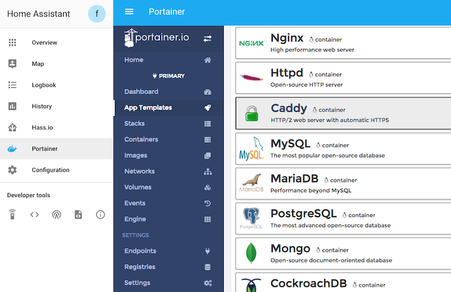

#
# 🗿• fordys-ha-repo

My new (updated) Home Assistant Repository.

> nothing special here. everything is quick dirty coding or simply copy/paste.

---

## ⭐️ • Add-ons

Repo includes following add-ons:

###  | [1. Portainer Add-on](./portainer)

![Project Stage][a01-project-stage-shield][![License][a01-license-shield]](./LICENSES/A01.md)

> Web-based mangement for local Docker environment.

[![Sponsor Frenck via GitHub Sponsors][a01-github-sponsors-shield]][a01-github-sponsors]
---

### [| 2. Fordy's Custom Mario Kart Wii Server](./mkwii-srv)

> A simple solution for a local instance of [**Wiimmfi**](https://wiimmfi.de/)'s Mario Kart Wii-Gameserver + pre-installed **DNS**-Server for compatibility with real Wii-/Wii-U-Consoles.
#

---

### [| 3. mailcow Add-on](./mailcow-addon)

### **⚠️ W.I.P.**
> Install Mailcow in Home Assistant.
#
> [!TESTING! | everything CAN/WILL run unstable )

I haven't done a single performance test so far tbh.. So.. fingers crossed ig :)  

<!--portainer-->

[a01-aarch64-shield]: https://img.shields.io/badge/aarch64-yes-green.svg
[a01-amd64-shield]: https://img.shields.io/badge/amd64-yes-green.svg
[a01-armhf-shield]: https://img.shields.io/badge/armhf-yes-green.svg
[a01-armv7-shield]: https://img.shields.io/badge/armv7-yes-green.svg
[a01-commits-shield]: https://img.shields.io/github/commit-activity/y/hassio-addons/addon-portainer.svg
[a01-commits]: https://github.com/hassio-addons/addon-portainer/commits/main
[a01-contributors]: https://github.com/hassio-addons/addon-portainer/graphs/contributors
[a01-discord-ha]: https://discord.gg/c5DvZ4e
[a01-discord-shield]: https://img.shields.io/discord/478094546522079232.svg
[a01-discord]: https://discord.me/hassioaddons
[a01-docs]: https://github.com/hassio-addons/addon-portainer/blob/main/portainer/DOCS.md
[a01-forum-shield]: https://img.shields.io/badge/community-forum-brightgreen.svg
[a01-forum]: https://community.home-assistant.io/t/home-assistant-community-add-on-portainer/68836?u=frenck
[a01-frenck]: https://github.com/frenck
[a01-github-actions-shield]: https://github.com/hassio-addons/addon-portainer/workflows/CI/badge.svg
[a01-github-actions]: https://github.com/hassio-addons/addon-portainer/actions
[a01-github-sponsors-shield]: https://frenck.dev/wp-content/uploads/2019/12/github_sponsor.png
[a01-github-sponsors]: https://github.com/sponsors/frenck
[a01-i386-shield]: https://img.shields.io/badge/i386-no-red.svg
[a01-issue]: https://github.com/hassio-addons/addon-portainer/issues
[a01-license-shield]: https://img.shields.io/github/license/hassio-addons/addon-portainer.svg
[a01-maintenance-shield]: https://img.shields.io/maintenance/yes/2021.svg
[a01-patreon-shield]: https://frenck.dev/wp-content/uploads/2019/12/patreon.png
[a01-patreon]: https://www.patreon.com/frenck
[a01-project-stage-shield]: https://img.shields.io/badge/project%20stage-%20!%20DEPRECATED%20%20%20!-ff0000.svg
[a01-reddit]: https://reddit.com/r/homeassistant
[a01-releases-shield]: https://img.shields.io/github/release/hassio-addons/addon-portainer.svg
[a01-releases]: https://github.com/hassio-addons/addon-portainer/releases
[a01-repository]: https://github.com/hassio-addons/repository
